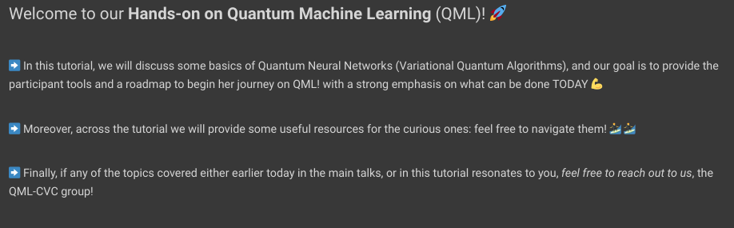

# Welcome to your Quantum Machine Learning Journey!

## Hand's on tutorial
We will also make a hands-on tutorial for anyone interested in quantum computing libraries. Here, we cover basic concepts of quantum information & computing, and then dive into PennyLane, an incredible quantum machine learning Python-library. **[LINK to the Colab!](https://colab.research.google.com/drive/1Ye4d8aDY_UbKHEEq7r_H8lEWIr82WJpO?usp=sharing)
 **

