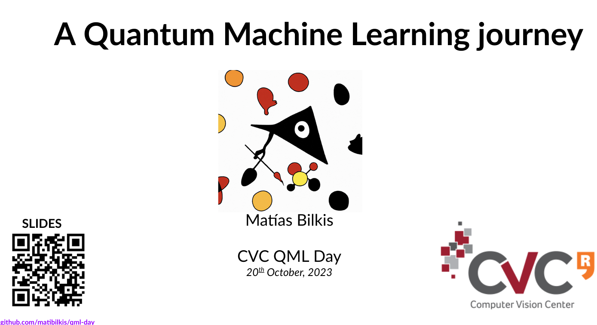

# Welcome to your Quantum Machine Learning Journey!
### This repo is to support our QML-day at CVC, happening on 20th Oct 2023!

## About my talk
At 12.15 I will give an introductory talk, access to the slides [here](https://docs.google.com/presentation/d/1uTPYGsvbrCgCXyFAZ5NbknEswM_FWLU2AbOPG1Prl_8/edit?usp=sharing)

## Hand's on tutorial
We will also make a hands-on tutorial for anyone interested in quantum computing libraries. Here, we cover basic concepts of quantum information & computing, and then dive into PennyLane, an incredible quantum machine learning Python-library. **[LINK to the Colab!](https://colab.research.google.com/drive/19_Mx6u5sW5tp7nljQRrriKk6Q6xqlPd0?usp=sharing)
 **

